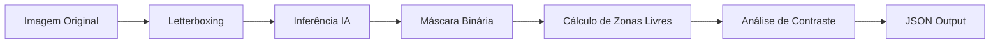

# 🗺️ Agente 01 — "O Topógrafo"

## Visão Computacional para Proteção de Contexto

---

## 1. Missão

Mapear a imagem para garantir que o texto inserido jamais cubra a joia (produto) ou a modelo (contexto humano), identificando as zonas seguras de alto contraste para aplicação de informações.

---

## 2. O Problema que Este Agente Resolve

- **Oclusão de Produto:** Evita cobrir a peça que está sendo vendida.
- **Poluição Visual:** Evita escrever sobre o rosto ou pele da modelo.
- **Ilegibilidade:** Resolve o problema de colocar texto preto em fundo escuro (e vice-versa) antes mesmo do texto ser gerado.
- **Distorção Geométrica:** Trata imagens verticais (Stories) e horizontais sem quebrar o mapeamento de coordenadas.

---

## 3. Competência Técnica

| Conceito | Descrição |
|---|---|
| **Salient Object Detection** | Identifica tudo o que é "figura" (joia + pessoa) e separa do "fundo". |
| **Luminance Analysis** | Analisa o brilho médio das zonas livres para definir a cor da fonte. |
| **Letterboxing (Padding)** | Redimensiona a imagem mantendo a proporção (aspect ratio) para não distorcer coordenadas. |
| **MaxRect Algorithm** | Calcula o maior retângulo possível dentro de uma área irregular livre. |

---

## 4. Stack Tecnológico

### Opção A — Low-Code (MVP Rápido)

| Componente | Tecnologia | Justificativa |
|---|---|---|
| **Segmentação** | Roboflow / Inference API | Modelo pré-treinado em "Foreground" ou "Jewelry". |
| **Pré-processamento** | OpenCV / PIL | Para Letterboxing e análise de histograma de cores. |

### Opção B — Produção (Alta Fidelidade)

| Componente | Tecnologia | Justificativa |
|---|---|---|
| **Segmentação** | DIS (Dichotomous Image Segmentation) | Estado da arte para recortes de alta precisão (cabelos, correntes finas). |
| **Runtime** | ONNX Runtime | Execução local otimizada na Unidade X:. |

---

## 5. Pipeline de Processamento Otimizado



---

## 6. Detalhamento Técnico das Etapas

### 6.1. Pré-Processamento (Letterboxing)

Jamais fazer "stretch" da imagem. Usamos *padding* para preencher o que falta para o quadrado perfeito (1024x1024), garantindo que a IA veja a geometria real.

```python
def letterbox_image(image, target_size=(1024, 1024)):
    """
    Redimensiona mantendo a proporção e adiciona bordas (padding).
    Retorna a imagem processada e os fatores de escala para reverter as coordenadas depois.
    """
    iw, ih = image.size
    w, h = target_size
    scale = min(w/iw, h/ih)
    nw = int(iw * scale)
    nh = int(ih * scale)

    image = image.resize((nw, nh), Image.BICUBIC)
    new_image = Image.new('RGB', target_size, (128, 128, 128)) # Fundo cinza neutro
    new_image.paste(image, ((w-nw)//2, (h-nh)//2))
    
    return new_image, scale, (w-nw)//2, (h-nh)//2

```

### 6.2. Segmentação (Joia + Modelo)

O modelo deve retornar uma máscara onde **1 = Zona Proibida** (Joia, Pele, Roupa) e **0 = Zona Livre** (Fundo).

### 6.3. Cálculo de Zonas e Contraste

O Topógrafo entrega a "faca e o queijo" para o Diagramador. Ele não apenas diz "aqui está livre", ele diz: *"Aqui está livre E você deve usar texto BRANCO"*.

```python
def analyze_zone_contrast(image_region):
    """
    Calcula luminância (Y) da região livre.
    Fórmula: Y = 0.299R + 0.587G + 0.114B
    """
    # ...código de média de pixels...
    if avg_luminance < 128:
        return "light_font" # Fundo escuro -> Texto Claro
    else:
        return "dark_font"  # Fundo claro -> Texto Escuro

```

---

## 7. Output Final (Contrato JSON)

Este é o payload que o Agente 01 entrega para o Agente 03.

```json
{
  "meta": {
    "original_dims": [1080, 1920],
    "processed_dims": [1024, 1024],
    "padding": {"top": 0, "bottom": 0, "left": 224, "right": 224},
    "scale_factor": 0.533
  },
  "protection_mask": "base64_encoded_mask...",
  "free_zones": [
    {
      "id": "zone_top_center",
      "type": "rectangle",
      "coords": {"x": 224, "y": 50, "w": 576, "h": 200},
      "area_px": 115200,
      "properties": {
        "avg_luminance": 45,
        "suggested_font_color": "#FFFFFF", 
        "contrast_ratio": 15.2
      }
    },
    {
      "id": "zone_bottom_left",
      "type": "rectangle",
      "coords": {"x": 250, "y": 800, "w": 300, "h": 150},
      "area_px": 45000,
      "properties": {
        "avg_luminance": 210,
        "suggested_font_color": "#000000",
        "contrast_ratio": 12.5
      }
    }
  ],
  "failsafe_triggered": false
}

```

---

## 8. Tratamento de Erros (Failsafe)

Se a API de visão falhar ou demorar > 5s:

1. Assume-se uma **"Máscara de Segurança Central"**.
2. Bloqueia-se os 40% centrais da imagem (círculo ou quadrado).
3. Define-se as zonas livres apenas nas bordas extremas (Top/Bottom).
4. Sugere-se **texto com sombra (outline)** obrigatoriamente, pois não foi possível calcular o contraste do fundo.

---

> **Resumo:** O Topógrafo agora é responsável pela geometria (proporção), proteção do contexto (joia+modelo) e análise física da luz (contraste), entregando ao Diagramador um mapa pronto para execução.
