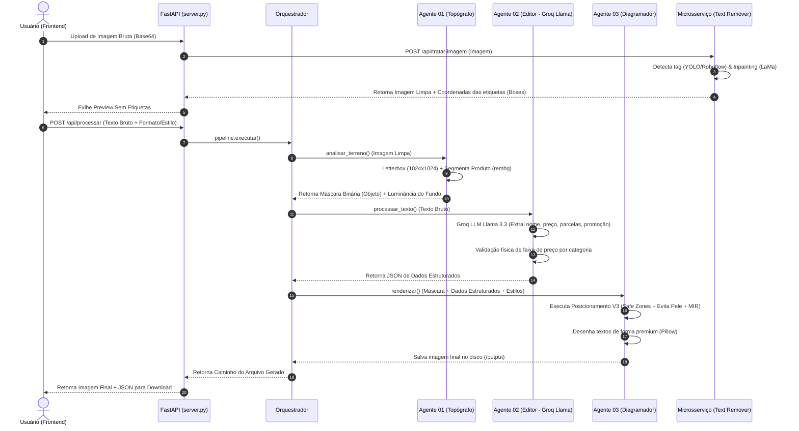

# 💎 Precifica.AI — Documento de Arquitetura Técnica e Lógica de Negócio (v1.1)

Este documento foi elaborado para fornecer a um engenheiro de software ou cientista de dados uma visão completa, clara e detalhada de todo o projeto **Precifica.AI**, abrangendo a stack tecnológica, o fluxo de execução, a lógica de inteligência artificial de cada agente e a integração com o microsserviço auxiliar de remoção de texto.

---

## 1. Visão Geral do Produto

O **Precifica.AI** é uma ferramenta de automação de design voltada para joalherias. O objetivo é transformar imagens brutas de produtos (muitas vezes com etiquetas de preços de fornecedores ou fundos poluídos) e textos informais fornecidos por lojistas (ex: *"colar de quenga 20 reais ou 10 de 2"*) em cards de marketing profissionais prontos para o Instagram (Feed Quadrado, Feed Retrato, Stories) ou WhatsApp, tudo de forma automatizada e em poucos segundos.

---

## 2. Stack Tecnológica

O ecossistema é modularizado em três componentes principais:

### A. Frontend (`precifica-frontend`)
*   **Core:** React 18 + Vite (SPA ágil e moderno).
*   **Estilização:** Tailwind CSS (layouts flexíveis e modernos).
*   **Empacotamento Mobile:** Capacitor JS (preparado para build nativo Android/iOS).
*   **Distribuição:** O build de produção é servido diretamente pelo servidor backend principal a partir da pasta `/frontend`.

### B. Backend Principal (`PrecificaAI`)
*   **Servidor:** FastAPI (Python 3.x), rodando sob Uvicorn com suporte assíncrono.
*   **Processamento de Imagem & Layout:** Pillow (PIL), NumPy e OpenCV (OpenCV-Python).
*   **Segmentação de Objetos:** `rembg` (baseado em modelos U2Net para remoção/recorte automático de fundo).
*   **Inteligência Artificial (NLP):** Groq SDK utilizando o modelo `llama-3.3-70b-versatile` para processamento determinístico e extração estruturada de texto.

### C. Microsserviço de Visão Auxiliar (`text-remover`)
*   **Servidor:** FastAPI (Python 3.x) rodando na porta `8000`.
*   **Detecção de Etiquetas:** API do Roboflow (Modelo customizado treinado: `jewelry-detection-wktjn/1`).
*   **Inpainting (Preenchimento de Pixels):** Modelo **LaMa** (`simple-lama-inpainting` com execução forçada em CPU).

---

## 3. Arquitetura do Sistema e Fluxo de Dados

O fluxo de dados segue uma esteira linear dividida em etapas coordenadas. Abaixo está a representação lógica da orquestração:



---

## 4. O Coração do Backend: Os 3 Agentes Autônomos

A orquestração do processamento é controlada pelo `PipelinePrecifica` no arquivo [orquestrador.py](file:///x:/Dev/TEXTOJOIA/Antigravity/PrecificaAI/orquestrador.py). Ele executa a sequência ordenada dos três agentes.

### 4.1. Agente 01 — "O Topógrafo" (`agents/topografo.py`)
Focado em visão computacional básica e proteção de contexto humano e do produto.

*   **Letterboxing Inteligente:** Redimensiona a imagem original mantendo a proporção (aspect ratio) e a centraliza em uma tela quadrada padrão de $1024 \times 1024$ pixels. 
    *   *Diferencial Técnico:* Evita o uso de cinza fixo ou borda branca rígida. O algoritmo extrai a cor mediana das bordas da imagem original (amostragem de 15px de borda) e preenche a área excedente com essa cor, gerando uma extensão natural e imperceptível.
*   **Segmentação de Produto:** Utiliza a biblioteca `rembg` (com `only_mask=True`) para criar uma máscara de recorte pixel-perfeita. Essa máscara é convertida para uma matriz NumPy binária ($1 = \text{Objeto Proibido}$, $0 = \text{Fundo Livre}$).
*   **Análise de Contraste Local:** Analisa a luminância média ($Y = 0.299R + 0.587G + 0.114B$) da região da imagem em que o texto teoricamente ficaria. Se a luminância for menor que $128$ (0 a 255), usa texto claro (`light_font`); caso contrário, fontes escuras (`dark_font`).

---

### 4.2. Agente 02 — "O Editor" (`agents/editor.py`)
Focado em Processamento de Linguagem Natural (NLP) livre de Expressões Regulares (Regex) puras, que costumam quebrar com erros de digitação e abreviações.

*   **LLM Fallback Determinístico:** Realiza requisições HTTP para a API do Groq (Llama 3.3 70B) passando o texto livre fornecido pelo lojista.
*   **Extração e Normalização de Campos:** O prompt de sistema orienta a LLM a extrair os seguintes campos sob um contrato JSON rígido:
    *   `produto`: Nome limpo, capitalizado e sem termos de preço.
    *   `preco_valor`: Float do preço principal.
    *   `preco_texto`: Formatado como moeda brasileira (ex: `R$ 89,90`).
    *   `modo`: Identificação do modelo comercial (`padrao`, `parcelado`, `ambos`, ou `promocao`).
    *   `parcelas`: Quantidade e valor individual (ou `null`).
    *   `preco_antigo`: Preço original da promoção (usado no modo `promocao`).
*   **Tratamento de Abreviações e Gírias:** O agente expande abreviações automaticamente baseando-se no vocabulário pré-cadastrado no prompt (ex: *"bri"* $\rightarrow$ Brinco, *"col"* $\rightarrow$ Colar, *"prt"* $\rightarrow$ Prata).
*   **Validação de Faixa de Preço:** Possui faixas de preços plausíveis baseadas em categorias (ex: *Brinco* de R\$ 15,00 a R\$ 5.000,00). Se a LLM extrair um valor fora dessa faixa (como confundir a medida `18k` ou `925` com preço), o agente gera um alerta no JSON de validação.

---

### 4.3. Agente 03 — "O Diagramador" (`agents/diagramador.py`)
Focado em design gráfico programático, tipografia avançada e prevenção de oclusão do produto.

*   **Renderização Premium (Sem Stroke):** Evita fontes de aspecto amador com contornos pretos rígidos. Aplica quatro metodologias elegantes de contraste selecionadas dinamicamente:
    *   `sombra`: Aplica um *Gaussian Blur* suave (via Pillow `ImageFilter`) na camada de sombra (com opacidade média de 63%) e deslocamento proporcional de pixels antes de desenhar o texto principal.
    *   `caixa` (Unificada): Desenha um contorno de retângulo arredondado branco translúcido (`RGBA: 255, 255, 255, 230`) englobando todo o bloco vertical de texto, aplicando contraste plano (`flat`) e garantindo leitura 100% legível em imagens muito texturizadas.
    *   `backdrop`: Efeito glass estilo iOS, desenhando um box desfocado e semi-transparente apenas na área do texto.
    *   `barra`: Desenha uma barra horizontal semi-transparente estendida de lado a lado.
*   **Adaptador de Formatos Dinâmicos:** Converte a proporção do canvas para três templates comuns:
    1.  *Feed Quadrado* ($1080 \times 1080$)
    2.  *Feed Retrato* ($1080 \times 1350$, proporção 4:5)
    3.  *Stories* ($1080 \times 1920$, proporção 9:16)
    *   *Lógica de Corte (Cover):* Se a imagem precisar se adaptar a Feed, o algoritmo realiza um Crop Centralizado dinâmico esticando a imagem para preencher todo o espaço e evitando faixas pretas. Para Stories, o comportamento é adaptativo baseando-se na orientação da imagem.
*   **Ajuste Dinâmico de Texto (`_ajustar_texto_na_area`):** Se o título do produto for muito longo para o espaço livre disponível:
    1.  Tenta reduzir o tamanho da fonte em até 30% (tamanho mínimo de 16px).
    2.  Se ainda assim não couber, divide o texto em duas linhas.
    3.  Como último recurso, aplica truncamento inteligente adicionando `"..."`.

---

## 5. Algoritmo de Posicionamento Otimizado (`posicionamento_v3.py`)

A maior inovação lógica do projeto reside no motor matemático em [posicionamento_v3.py](file:///x:/Dev/TEXTOJOIA/Antigravity/PrecificaAI/agents/posicionamento_v3.py). Ele utiliza técnicas híbridas de design e processamento vetorial para encontrar a coordenada ótima de texto.

### 5.1. Margens Invisíveis (Safe Zones)
Antes de pontuar os locais possíveis, o sistema restringe as coordenadas úteis aplicando margens físicas baseadas no formato (original: 5%, Stories: 8% no topo/base para escapar das marcas de relógio e botões do Instagram).

### 5.2. Detecção de Pele Vetorizada (Sistema Anti-Pele)
Para evitar que o texto seja desenhado sobre rostos, braços ou colos de modelos (o que destrói a estética profissional), o script executa um filtro matricial vetorizado via NumPy (tempo de execução $< 20\text{ms}$):
```python
# Filtro vetorial baseado em balanço de canais RGB
mask_pele = (r > 60) & (g > 40) & (b > 20) & (r > g) & (r > b) & (np.abs(r - g) > 10) & ((r - b) > 15)
```
Essa máscara é combinada à máscara do produto gerada pelo `rembg`, formando o mapa consolidado de **Zonas Proibidas**.

### 5.3. Sistema de Pontuação de Candidatos (Scoring)
O algoritmo gera uma série de zonas candidatas no espaço de safe zones, aplicando princípios de composição fotográfica clássica (Regra dos Terços, Proporção Áurea) e calcula a melhor pontuação:

$$\text{Score} = 100 \ (\text{Base}) - (60 \times \text{Percentual de Sobreposição com Zonas Proibidas}) + \text{Bônus da Zona} + \text{Bônus da Área} - \text{Penalidades}$$

#### Tabela de Atribuição de Bônus por Posição:
| Zona Candidata | Altura Relativa | Bônus | Justificativa Visual |
| :--- | :--- | :--- | :--- |
| **Terço Inferior** | ~70% | **+35** | O melhor arranjo para varejo (produto em evidência no centro, preço no rodapé). |
| **Stories Base/Topo** | Fora da foto | **+30** | Aproveita as faixas pretas superior/inferior em imagens wide no Stories. |
| **Golden Ratio Inferior** | ~61.8% | **+30** | Posição áurea (Linha de Ouro) de descanso visual da visão. |
| **Esquerda/Direita Inferior**| ~70% lat | **+25** | Perfeito para composições laterais quando o modelo está no lado oposto. |
| **Terço Superior** | ~10-20% | **+20** | Usado quando o produto ocupa majoritariamente a metade inferior da tela. |
| **Safe Bottom** | ~85% | **+10** | Fallback padrão de rodapé extremo. |

*   **Upgrade Defensivo (Failsafe):** Se nenhuma zona candidata obtiver um score aceitável (menor que $40$ devido ao produto/modelo ocupar toda a imagem), o sistema força o posicionamento no rodapé (`safe_bottom_forcado`), mas realiza o override automático do renderizador para usar `caixa` (box branco) garantindo 100% de leitura mesmo sobreposto ao objeto.

---

## 6. O Microsserviço `text-remover`

Quando o usuário sobe a imagem no aplicativo, o sistema precisa "limpar" as informações originais antes de diagramar as novas artes. Esse microsserviço cuida dessa higienização.

```
                  ┌──────────────────────┐
                  │ Imagem Bruta Upload  │
                  └──────────┬───────────┘
                             │
                             ▼
              ┌──────────────────────────────┐
              │ 1. Detecção YOLO (Roboflow)  │ ──► Obtém caixas de etiqueta [[x, y, w, h]]
              └──────────────┬───────────────┘
                             │
                             ▼
              ┌──────────────────────────────┐
              │ 2. Criação de Máscara (OpenCV)│ ──► Dilatação morfológica elíptica (15x15)
              └──────────────┬───────────────┘       + Blur Gaussiano (suavização)
                             │
                             ▼
              ┌──────────────────────────────┐
              │ 3. Inpainting (LaMa Model)   │ ──► Preenchimento inteligente de pixels
              └──────────────┬───────────────┘       baseado em vizinhança
                             │
                             ▼
                  ┌──────────────────────┐
                  │ Imagem Limpa Base64  │
                  └──────────────────────┘
```

1.  **Detecção de Preços Prévios:** Utiliza um modelo YOLO hospedado no Roboflow para obter as caixas de detecção (`boxes`) que englobam a etiqueta. O Roboflow retorna as coordenadas de centro, as quais são convertidas para coordenadas de canto superior esquerdo $[x, y, w, h]$.
2.  **Geração e Dilatação de Máscara (`create_mask`):** O OpenCV desenha as caixas e aplica um Kernel Elíptico de dilatação ($15 \times 15$ pixels) para englobar as bordas reais do adesivo, aplicando depois um *GaussianBlur* ($21 \times 21$) e binarização leve para gerar uma transição suave.
3.  **Inpainting com LaMa:** A biblioteca `SimpleLama` lê a imagem e a máscara gerada para repintar e preencher a área removida com texturas compatíveis com a vizinhança do fundo da foto original.

---

## 7. Contratos de API (JSON Schemas)

### 7.1. Endpoint Principal: `POST /api/processar`
*Responsável pelo processamento completo e síncrono da imagem individual.*

**Request Payload:**
```json
{
  "image": "data:image/jpeg;base64,/9j/4AAQSkZJRgABAQAAAQABAAD/2wBDAAMCAgMCAgMDAwMEAwMEBQpg...",
  "texto": "colar de prata bali 120 reais ou 10x 12 sem juros",
  "config": {
    "formato": "feed_quadrado",
    "paleta": "classico",
    "modo_preco": "ambos"
  }
}
```

**Response Payload:**
```json
{
  "status": "success",
  "url_resultado": "/output/colar_de_prata_bali_R$120,00.jpg",
  "dados_extraidos": {
    "produto": "Colar de Prata Bali",
    "preco_texto": "R$ 120,00",
    "preco_valor": 120.0,
    "modo_detectado": "ambos",
    "parcelas": {
      "quantidade": 10,
      "valor_parcela": 12.0
    },
    "preco_antigo": null,
    "linha_preco_antigo": "",
    "linha_parcelas": "ou 10x R$ 12,00",
    "categoria": "Colar",
    "validacao_preco": {
      "valido": true
    },
    "fonte": "groq",
    "tempo_ms": 450
  },
  "tempo_processamento_ms": 780
}
```

---

### 7.2. Endpoint de Renderização Direta: `POST /api/renderizar`
*Utilizado após o Passo 3.5 (Card de Confirmação no Frontend). Pula o agente de NLP (Agente 02) caso o usuário edite o texto manualmente.*

**Request Payload:**
```json
{
  "image": "data:image/jpeg;base64,/9j/4AAQSkZJRg...",
  "dados_confirmados": {
    "produto": "Brinco Ouro 18k Argola",
    "preco_texto": "R$ 350,00",
    "preco_valor": 350.0,
    "parcelas": "10x R$ 35,00"
  },
  "config": {
    "formato": "stories",
    "paleta": "moderno",
    "modo_preco": "parcelado"
  }
}
```

**Response Payload:**
```json
{
  "status": "success",
  "url_resultado": "/output/Brinco_Ouro_18k_Argola_R$350,00.jpg",
  "dados_extraidos": {
    "produto": "Brinco Ouro 18k Argola",
    "preco_texto": "R$ 350,00",
    "preco_valor": 350.0,
    "parcelas": "10x R$ 35,00"
  }
}
```

---

## 8. Diagnóstico de Resolução de Erros Comuns

1.  **Timeout / Erro na LLM (Groq):** O `Editor` possui um sistema de re-tentativa (`retry`) nativo e transparente com espaçamento de 1 segundo para lidar com limites de requisição (*rate limits*) e picos na API do Llama.
2.  **Oclusão Crítica detectada no Diagramador:** Se a imagem contiver o produto ocupando mais de $85\%$ da área de tela útil (ex: foto em macro extremo de um anel), o algoritmo `posicionamento_v3` ativará a rotina de caixa unificada translúcida desenhada no rodapé da imagem. O contraste do texto é invertido para escuro (`#1A1A1A`) para manter legibilidade sob a caixa branca.
3.  **Ambiente sem GPU para LaMa:** O carregador dinâmico em `inpainting_service.py` aplica um *monkeypatch* em `torch.jit.load` interceptando o carregamento do modelo serializado da rede neural e direcionando-o obrigatoriamente para a CPU (`map_location=torch.device('cpu')`), prevenindo travamentos em servidores que não contam com CUDA.

---
*Este documento é a especificação oficial de engenharia do Precifica.AI. Modificações na lógica de posicionamento de design ou regras de marca devem atualizar a chave `settings` e as tabelas e pesos listados nas seções 4 e 5.*
